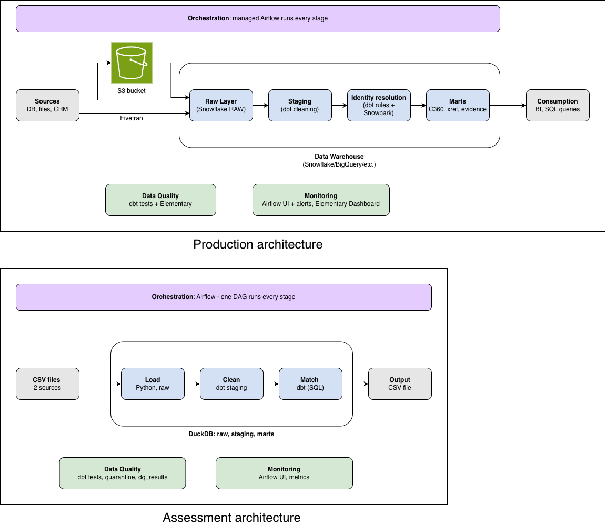

# 2. Architecture

*Editable source: [`architecture.drawio`](architecture.drawio) (open with [diagrams.net](https://app.diagrams.net)).*

## How I approached the design
Ideally the tech stack depends on the client: if they already have a stack that can solve the business problem, that is preferred over an "ideal" stack. I worked through:

1. **Requirements gathering** (+ back-of-envelope sizing)
   - Functional: who consumes the data, what they need (a consolidated customer dataset), how they access it (SQL, BI tools, APIs)
   - Non-functional: latency SLA, volume, availability, data retention
2. **Pipeline design** - batch vs streaming (batch: daily refresh is enough)
3. **Data modelling** - medallion layers: raw (bronze) -> staging (silver) -> marts (gold)
4. **Storage and file formats** - warehouse tables; open formats (Parquet / Iceberg) if a lakehouse is preferred
5. **Data quality and observability** - checks at every layer, results stored, pipeline monitoring
6. **Scalability, backfill and DataOps** - idempotent (safe-to-rerun) steps, backfills, schema changes handled per source

## Production vs assessment

| Component | Production recommendation | Implemented in this assessment |
|---|---|---|
| Sources | DB, files, CRM | Two CSV files (CRM, online store) |
| Ingestion | Files land in an S3 bucket; Fivetran for databases and SaaS (CRM) | `scripts/load_raw.py` loads the files listed in `config/sources.yml`, unchanged |
| Storage | Data warehouse (Snowflake / BigQuery / etc.): RAW -> STAGING -> MARTS | DuckDB file with raw, staging, intermediate and marts schemas |
| Processing | dbt cleaning models | dbt staging models with shared cleaning macros |
| Identity reconciliation | dbt rules (+ Snowpark Python where SQL is clumsy) | dbt: blocking, weighted scoring, grouping into customers, golden record |
| Data quality | dbt tests + Elementary | dbt tests (error / warn), quarantine table, `dq_results` table, accuracy check |
| Orchestration | Managed Airflow runs every stage | Airflow: one DAG runs every stage (Docker Compose) |
| Monitoring | Airflow UI + alerts, Elementary dashboard | Airflow UI, run metrics table and `run_summary.json` |
| Consumption | BI tools, SQL queries | Marts tables (SQL) and CSV exports in `output/` |

## Key technology choices and trade-offs

| Decision | Chosen | Over | Trade-off |
|---|---|---|---|
| Production warehouse | Snowflake (or the client's existing BigQuery etc.) | Databricks | SQL-first and low admin, fits an analytics team writing SQL. Databricks would win if matching became ML-heavy at large scale |
| Local engine | DuckDB | Snowflake trial, Postgres | Runs offline with one command and no accounts; single machine, one writer at a time. The same dbt models run on Snowflake by switching the dbt target |
| Transformations | dbt | Plain Python / pandas scripts | Tested, documented, shows lineage, rules kept in config; Python only for loading and export |
| Matching | Weighted rules + human review | Probabilistic (Splink, Zingg), commercial MDM tools | Every decision is explainable and needs no training data; may miss some messy matches. Upgrade path: Splink / Zingg |
| Orchestration | Airflow | Dagster, cron | Industry standard; kept thin (logic lives in dbt), so it is easy to swap |
| Freshness | Daily batch | Streaming | Much simpler and cheaper; not suited to real-time use cases |
