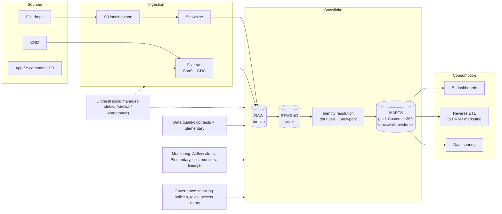
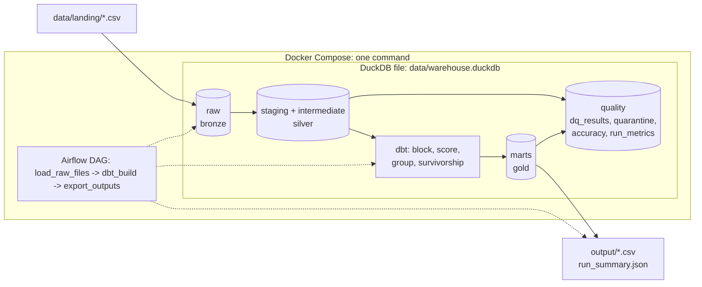

# 2. Architecture

## 2a. Production recommendation

| Component | Production choice | What it does |
|---|---|---|
| Ingestion | Files land in S3 and Snowpipe auto-loads them; Fivetran for SaaS (CRM) and database change data capture | Brings raw data in unchanged; a new source is one connector/config entry |
| Storage | Snowflake RAW -> STAGING -> MARTS (medallion: bronze -> silver -> gold); raw files kept in S3 | Raw is never edited, so any day can be replayed; Time Travel for recovery |
| Processing | dbt SQL models; Snowpark Python only where SQL is clumsy | Converts every source to one standard customer shape |
| Identity reconciliation | dbt: blocking -> weighted rule scoring -> thresholds -> clustering -> persistent ID registry -> survivorship; rules in config tables | Customer 360, crosswalk, match evidence, review queue |
| Data quality | dbt tests per layer (error / warn), quarantine tables, Elementary anomaly checks (volume, freshness) | Catches bad data early, never drops rows silently, results stored as tables |
| Orchestration | Managed Airflow; one DAG triggered when new files land | Order, retries, backfills, run history |
| Monitoring | Airflow alerts to Slack/PagerDuty, Elementary dashboard, match KPIs, Snowflake resource monitors, dbt lineage | Know when something breaks or drifts and what it affects |
| Consumption | BI on marts; reverse ETL (Hightouch / Fivetran Activations) pushes the unified ID back to operational tools; Snowflake data sharing | Gets the unified customer to people and systems |
| Governance | Masking policies + roles on PII columns, access history, deletion via crosswalk, CI/CD (GitHub Actions), Terraform | Privacy, safe change, reproducible environments |

## 2b. Implemented in this assessment

| Component | Built here | Stands in for |
|---|---|---|
| Ingestion | `scripts/load_raw.py` loads every file listed in `config/sources.yml` into `raw`, all columns as text, plus source/file/load-time columns | S3 + Snowpipe + Fivetran |
| Storage | One DuckDB file: `raw`, `staging`, `intermediate`, `marts`, `quality`, `reference` schemas | Snowflake |
| Processing | dbt-duckdb staging models + shared cleaning macros | dbt on Snowflake |
| Identity reconciliation | dbt models: blocking, scoring from `seeds/match_rules.csv`, thresholds, recursive-SQL grouping, deterministic IDs, survivorship | Same logic + ID registry + steward UI |
| Data quality | 30+ dbt tests (error / warn), quarantine table, results logged to `quality.dq_results` after every run, accuracy vs answer key | dbt tests + Elementary |
| Orchestration | Airflow 3 (standalone) in Docker Compose, daily DAG that starts on launch | Managed Airflow |
| Monitoring | Airflow UI (runs, logs, retries) + `quality.run_metrics` history + `output/run_summary.json` | Alerts, Elementary, cost monitors |
| Consumption | `output/` CSVs; all tables queryable in DuckDB | BI, reverse ETL, data sharing |
| Governance | Documented only | Masking, roles, access history |

## 2c. Key technology choices and trade-offs

| Decision | Chosen | Over | Trade-off accepted |
|---|---|---|---|
| Production platform | Snowflake | Databricks, BigQuery | SQL-first, low admin, runs on any cloud. Would choose Databricks if matching became ML-heavy at large scale, BigQuery for a GCP-native client |
| Local engine | DuckDB | Snowflake trial, Postgres | Runs offline with one command and no accounts; single machine, single writer. Same dbt models move to Snowflake by switching the dbt target (a few function differences, e.g. Jaro-Winkler 0-1 vs 0-100) |
| Transformations | dbt | Python / pandas scripts | Tested, documented, lineage, config-driven; Python only for loading and export |
| Matching | Weighted rules + review queue | Probabilistic (Splink, Zingg), commercial MDM | Fully explainable, no training data, precision-first; misses some messy matches. Upgrade path: Splink / Zingg |
| Grouping | Recursive SQL inside dbt | Separate Python step | Whole transform stays one `dbt build`; fewer moving parts for Airflow |
| Orchestration | Airflow | Dagster, cron | Industry standard, cross-tool; kept thin so it is easy to swap |
| Data quality | dbt tests + results table | Great Expectations, Monte Carlo | Checks live next to the code they test; fewer ML anomaly features |
| Freshness | Daily batch | Streaming | Far simpler and cheaper; not suited to real-time personalisation |
